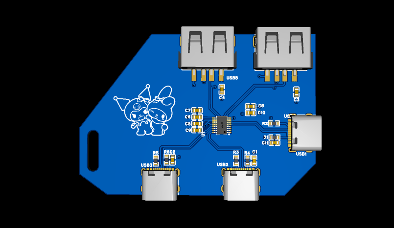
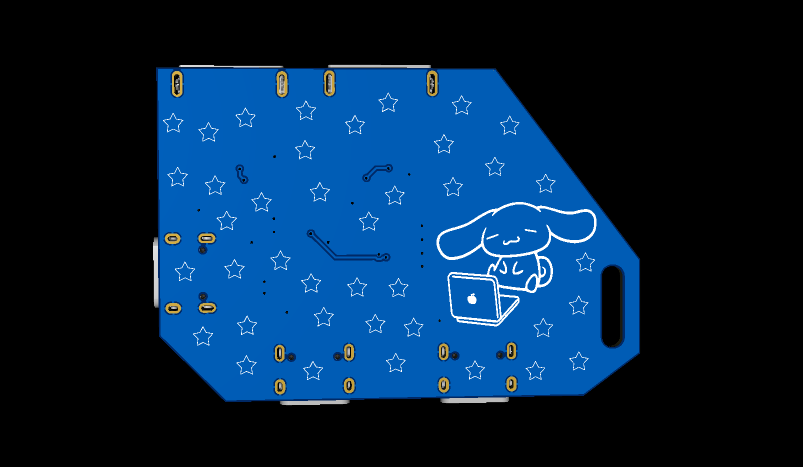
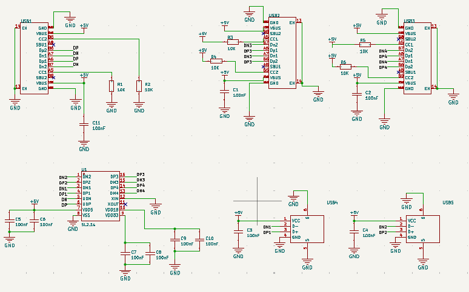

# USB-hub
## Description
  
It's a USB hub that can be conected through a USB type-C port, expanding one USB entrance to four, two USB type-A and two USB type-C.
I added my favorite Sanrio characters (My Melody, Kuromi and Cinnamoroll) to make is look cuter ^o^
(This is my first PCB project, i followed Macondo's (Hackclub) guide to build it :D)

## Components

1 SL2.1S from CoreChips
3 USB-C
2 USB-A
6 5.1K resistors
11 capacitors (8 of the 1uF type and 3 of the 100nF)
